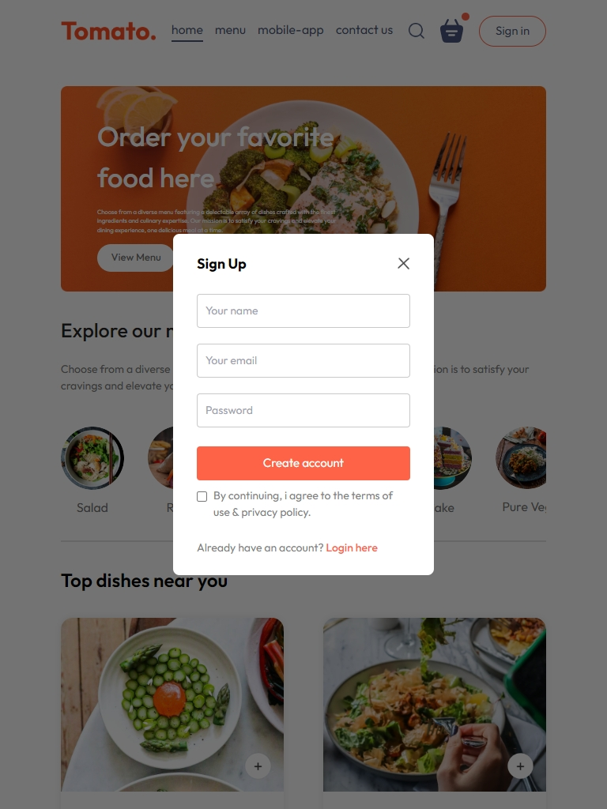

 
  <h1>Food Delivery App</h1>

 
  
   
  
  
  
  
  
  

## Description

The Food Delivery App is a web application built using React. It allows users to browse a variety of food items, view details about each item, add items to their cart, and proceed to checkout. The app utilizes Tailwind CSS for styling and React Context API for state management.

## Key Features

- **Explore Menu:** Users can explore different categories of food items.
- **Food Display:** Displays food items based on selected categories.
- **Add to Cart:** Users can add items to their cart for purchase.
- **Remove from Cart:** Items can be removed from the cart if desired.
- **Total Cart Amount:** The app calculates and displays the total amount in the cart.
- **Responsive Design:** Ensures optimal viewing experience across various devices.

## Screenshots

  
    
   
     
   

## Additional Information

- Icons used in the project are sourced from [React Icons](https://react-icons.github.io/react-icons/).
- This project uses Tailwind CSS for styling.
- Developed by Evelin Alvarado.
- Find me on [GitHub](https://github.com/EvelinAlvarado) and [LinkedIn](https://www.linkedin.com/in/evelinalvarado/).

Check out the live project: [Food Delivery App](https://food-delivery-app-responsive.vercel.app/)
